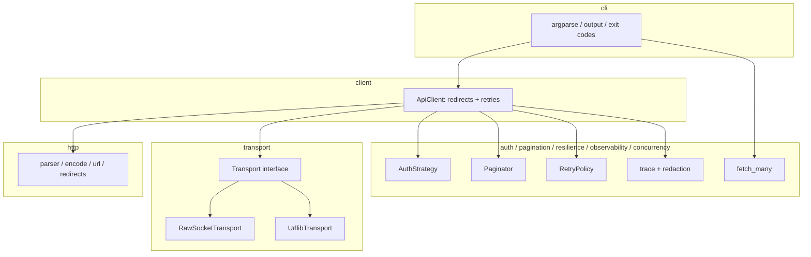

# Architecture

## Layer diagram (Mermaid)



## ASCII overview

```
┌──────────────────────────────────────────────────────────────┐
│                            cli                               │
│         argparse, subcommands, output formatting             │
└──────────────────────────────────┬───────────────────────────┘
                                   │
┌──────────────────────────────────▼───────────────────────────┐
│                          client                              │
│   ApiClient: redirects, retries, request lifecycle           │
└─────┬───────────────────────┬───────────────────────────┬────┘
      │                       │                           │
┌─────▼─────┐  ┌──────────────▼──────────┐  ┌─────────────▼──────┐
│   http    │  │       transport         │  │   auth /           │
│  parser   │  │  base + raw socket +    │  │   pagination /     │
│  encode   │  │  urllib + pool          │  │   resilience /     │
│  url      │  │                         │  │   observability    │
│  redirects│  │                         │  │   concurrency      │
└───────────┘  └─────────────────────────┘  └────────────────────┘
```

## Layering rules

* Each subpackage has a `base.py` defining the interface (`Transport`,
  `AuthStrategy`, `Paginator`).
* `client.py` depends only on those interfaces; never on a concrete backend.
* Nothing in `http/`, `transport/`, `auth/`, `pagination/`, or `resilience/`
  imports from `cli/`. The dependency graph runs in one direction.
* `observability/` is shared utility code; everything else may import it,
  but it imports only stdlib + `models`.

## Request lifecycle

```
cli.main.handle_request_command
     │
     ▼
ApiClient.request
     │  builds Request (headers, params, body)
     │  applies AuthStrategy
     ▼
ApiClient._send_with_redirects     ←──────────────┐
     │                                            │
     ▼                                            │
ApiClient._send_with_retries                      │
     │                                            │
     ▼                                            │
Transport.send  (raw socket OR urllib)            │
     │  serialize → DNS → TCP → (TLS) → send      │
     │  read response (Content-Length / chunked)  │
     ▼                                            │
Response  ────────  if redirect ───────────────── ┘
     │
     ▼
CLI output (pretty / raw / table / curl)
```

## Swap points

* **Transport** — `RawSocketTransport` vs `UrllibTransport`. The same `ApiClient`
  works against either. See [ADR 0001](adr/0001-raw-sockets-vs-library.md).
* **AuthStrategy** — Bearer / Basic / API key (header or query). Strategies are
  immutable; the trace and curl exporters redact what `secrets()` returns.
* **Paginator** — offset / page / cursor / link-header. All four respect
  `max_pages` and detect cycles.
* **RetryPolicy / RedirectPolicy** — immutable dataclasses on `ApiClient`.

## Concurrency model

The core client is synchronous and single-connection per request. The
`concurrency` subpackage adds an asyncio fan-out using `asyncio.to_thread`,
so the protocol implementation remains a single tested path. See
[ADR 0002](adr/0002-sync-core-async-layer.md).
